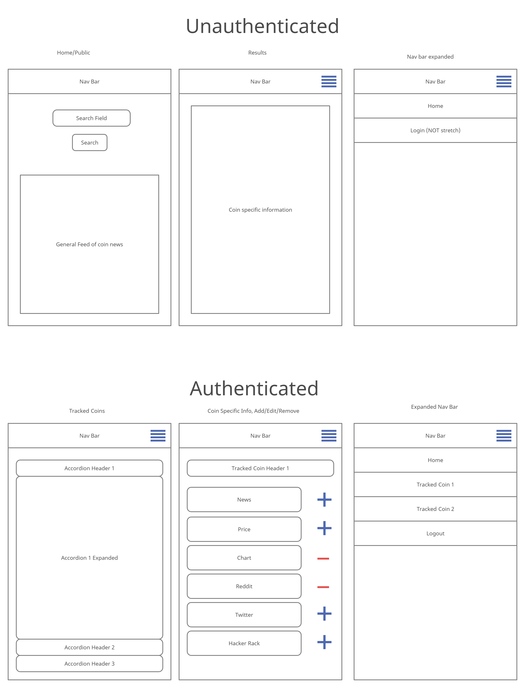

# Crypto-Tracks

## Team Members: 
- Tom McGuire
- Michael Ryan
- Tyler Johnson

#### Project Description
Crypto-Tracks is a responsive web app that allows the user to search for a coin and recieve prices, news and save coins they wish to track.

#### Problem Domain
Crypto-Tracks hopes to address the problem of organization in a specific space: the Crypto market. The app allows users to select what coins they wish to track and displays price and news information for those coins.

### Libraries, Frameworks, and Packages:
- Express
- Bootstrap
- MongoDB and Mongoose
- Auth0

### Instructions to run application: 
- Clone repo
- run npm install
- run npm start

### Crypto-Tracker Wireframe:
